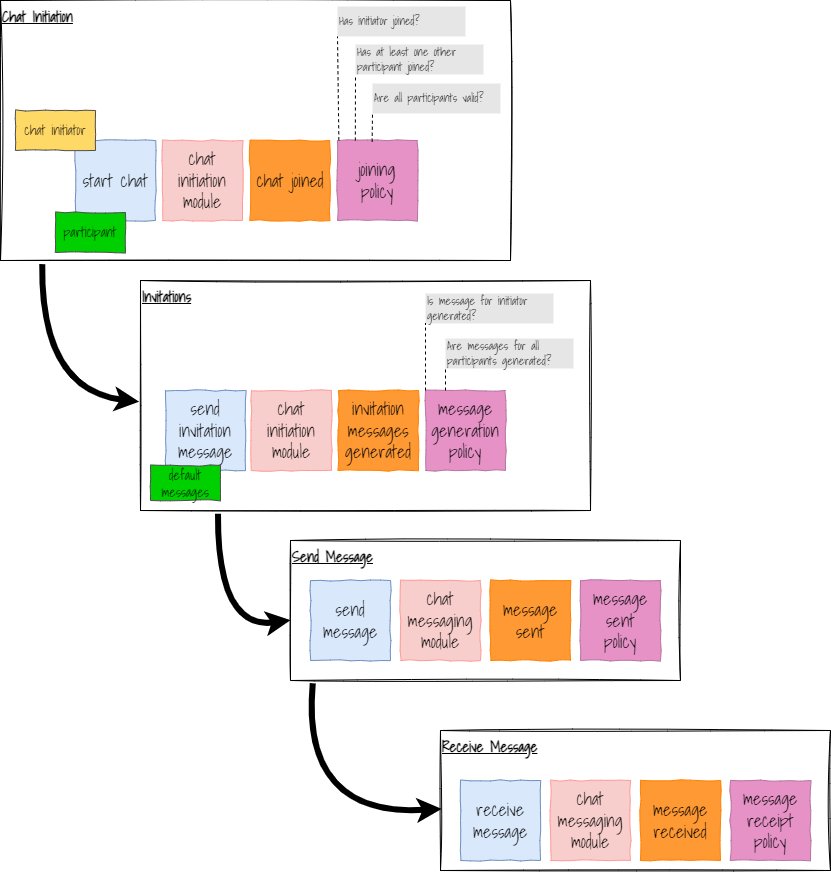

## Introduction
The intention of this project is to build a simple chat application. Key features will be:-
 - A chat is a session in which there are two or more participants
 - In a chat session the participants send text messages
 - A message sent in a session is seen by all participants in that session
 - Users login so that they can be identified in chat sessions
 - A user can be participating in multiple chat sessions at any time
 - All chat sessions persist. i.e. they are never closed.

 ## Approach
  - First define a minimum viable application
  - Then build additional features to the minimum viable application.

## Minimum Viable application
The diagram below shows the flow (Event Model) for a minimum viable application.

